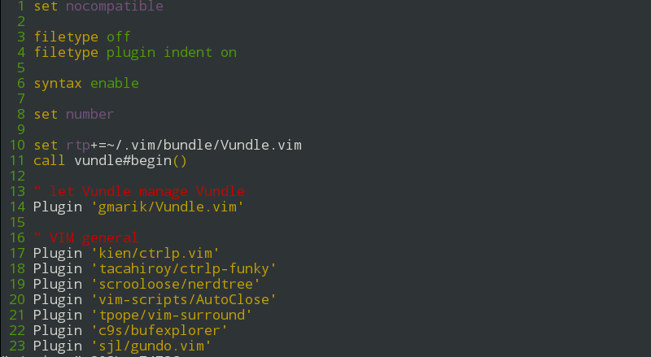

# vim-toggle-nerd-tree
My function to toggle display of Nerd tree window

## Installation
Using Vundle
```
Plugin 'gangleri/vim-toggle-nerd-tree'
```
By default I have bound &lt;leader&gt;n as the short cut.


